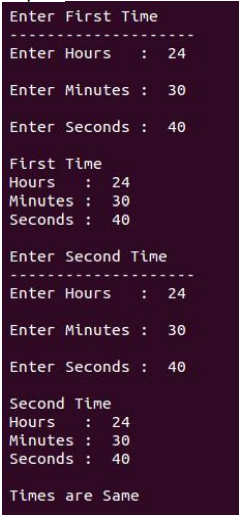
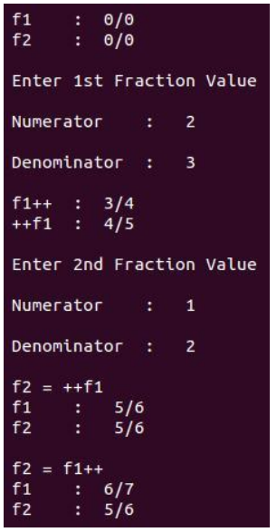
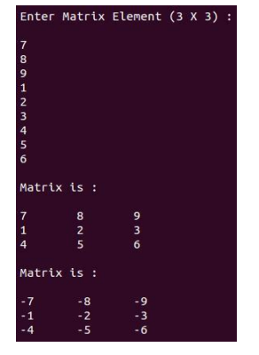
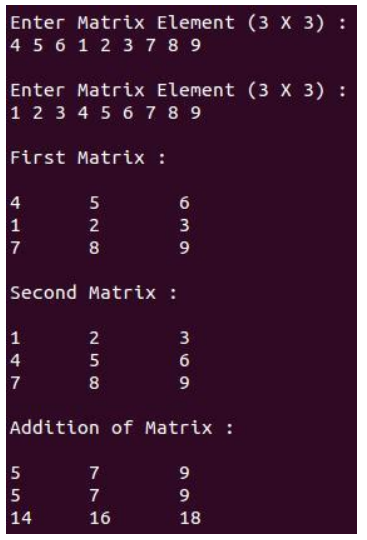

# 05 OOPS

### Problem Set

1. Define a class Complex to represent a complex number. Declare instance member variables to store real and imaginary part of a complex number, also define instance member functions to set values of complex number and print values of complex number.

2. Define a class Time to represent Time (like 3 hr 45 min 20 sec). Declare appropriate number of instance member variables and also define instance member functions to set values for time and display values of time.

3. Define a class Factorial and define an instance member function to find the Factorial of a number using class.

4. Define a class Complex to represent a complex number with instance variables a and b
   to store real and imaginary parts. Also define following member functions
   a. void setData(int,int)
   b. void showData()
   c. Complex add(Complex)

5. Define a class Time to represent a time with instance variables h,m and s to store hour,
   minute and second. Also define following member functions
   a. void setTime(int,int,int)
   b. void showTime()
   c. void normalize()
   d. Time add(Time)

6. Define a class Cube and calculate Volume of Cube and initialise it using constructor.

7. Define a class Date and write a program to Display Date and initialise date object using
   Constructors.

8. Define a class Bill and define its member function get() to take detail of customer ,
   calculateBill() function to calculate electricity bill using below tariff :
   Upto 100 unit RS. 1.20 per unit
   From 100 to 200 unit RS. 2 per unit
   Above 200 units RS. 3 per unit.

9. Define a class StaticCount and create a static variable. Increment this variable in a
   function and call this 3 times and display the result.

10. Define a class Complex with appropriate instance variables and member functions.
    Define following operators in the class:

    1. (+)
    2. (-)
    3. (\*)
    4. (==)

11. Write a C++ program to overload unary operators that is increment and decrement.

12. Write a C++ program to add two complex numbers using operator overloaded by a friend function.

13. Create a class Time which contains: Hours, Minutes, Seconds. Write a C++ program using operator overloading for the following:

-   (==) : To check whether two Times are the same or not.
-   (>>) To accept the time.
-   (<<) : To display the time.
    Output -

    

14. Consider following class Numbers

    ```c++
    class Numbers
    {
    int x,y,z;
    public:
    // methods
    };
    ```

    Overload the operator unary minus (-) to negate the numbers.

15. Create a class CString to represent a string. Overload the
    -   (+) operator to concatenate two strings.
    -   == to compare 2 strings.
16. Define a C++ class fraction

    ```c++
    class fraction
    {
    long numerator;
    long denominator;
    Public:
    fraction (long n=0, long d=0);
    }
    Overload the following operators as member or friend:
    a) Unary ++ (pre and post both)
    b) Overload as friend functions: operators << and >>.
    ```

    Output-

    

17. Consider a class Matrix

    ```c++
    Class Matrix
    {
    int a[3][3];
    Public:
    //methods;
    };
    ```

    Overload the - (Unary) should negate the numbers stored in the object.
    Output -
    

18. Consider the following class mystring

    ```c++
    Class mystring
    {
    char str [100];
    Public:
    // methods
    };
    ```

    Overload operator “!” to reverse the case of each alphabet in the string (Uppercase to
    Lowercase and vice versa).

19. Let m1 and m2 are two matrices. Find out m3=m1+m2 (use operator overloading).

    ```c++
    Class Matrix
    {
    int a[3][3];
    Public:
    //methods;
    };
    ```

    Output -

    

20. Define a class Complex with appropriate instance variables and member functions.
    Overload following operators
    a. << insertion operator
    b. >> extraction operator.

21. Overload subscript operator [] that will be useful when we want to check for an index out of bound.

22. Create a student class and overload new and delete operators as a member function of the class.

23. Create a complex class and overload assignment operator for that class.

24. Create a Coordinate class for 3 variables x,y and z and overload comma operator such that when you write c3 = (c1 , c2 ) then c2 is assigned to c3. Where c1,c2,and c3 are objects of 3D coordinate class.

25. Create an Integer class that contains int x as an instance variable and overload casting int() operator that will type cast your Integer class object to int data type.

26. Create a Distance class having 2 instance variable feet and inches. Also create default constructor and parameterized constructor takes 2 variables . Now overload () function call operator that takes 3 arguments a , b and c and set feet = a + c + 5 and inches = a+b + 15.

27. Create a class Marks that have one member variable marks and one member function
    that will print marks. We know that we can access member functions using (.) dot operator. Now
    you need to overload (->) arrow operator to access that function.
